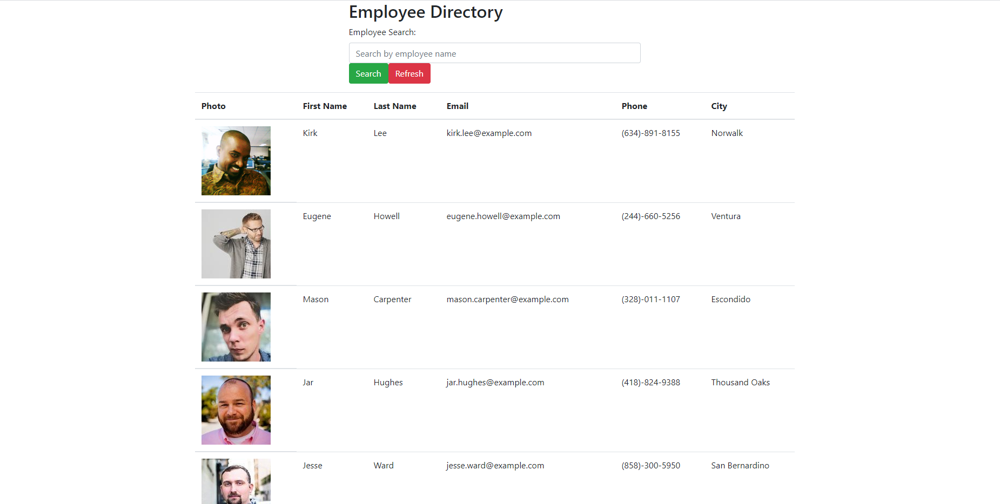

# Employee Directory Via React 
    
# Table of Contents
- [Description](#description)
- [Installation](#installation)
- [Usage](#usage)
- [License](#license)
- [Contributions](#contributions)
- [Tests](#tests)
- [Questions](#questions)
        
## Description:
This is an example of an employee directory using an API to generate the employees. It is meant to indicate a proper use of React by using a one page system and components to generate the page.
            
## Installation:
Clone the repo, npm i, npm start.
Github pages Link to active site: [link to Github Pages!](https://flynn0087.github.io/Employee_Directory_via_React/)
Here is an example image of the page: 
        
## Usage:
To have a list of employees with information provided. That can be sorted and filtered by name.

## License:
MIT
    
## Contributions:
W3school, github pages

## Tests:
no

## Questions:
Questions about the project can either be directed to:
[GitHub Profile](https://github.com/flynn0087)
Email: flynn0087@gmail.com
